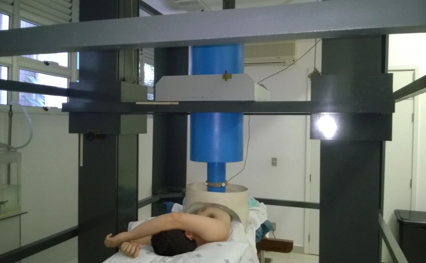

# Is the presence of iron in the body necessary? <h1>

<!--more-->

Yes, the presence of iron in the body is essential for the production of red cells, as this element makes up the active center of the hemoglobin and myoglobin molecule, which makes up 95% of these cells. Excess iron in the body often occurs due to a high rate of absorption from the natural diet by the gastrointestinal system, as happens in people with hemochromatosis or due to repeated blood transfusions generally carried out in anemic and sickle cell patients. [Bridges KR (1998)] (Further reading on the Sickle Cell Disease website).

The diagnosis of iron levels in patients with these anomalies is of fundamental importance for medical control, especially in those who are subjected to repeated transfusions and chelation treatment (a substance that sequesters Fe3+ to be excreted). A method that allows the iron level in the liver to be quantified non-invasively is the measurement of the magnetic susceptibility (SM) of the iron distributed in the liver tissue [Fischer et al. (1998), Bastucheck and Williamson (1985), Carneiro et al. (2000), Carneiro (2004)].

