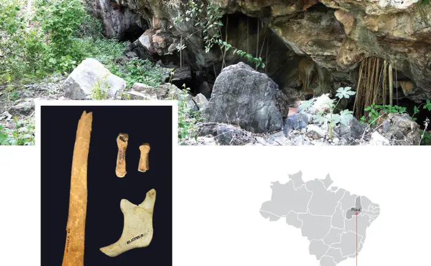

# Spectroscopic technique used to study materials containing unpaired electrons is used in archeology dating. <h1>

<!--more-->

All physical dating methods involve measuring some property of the material under study that varies with time. The carbon-14 (C-14) method measures the amount of this unstable radioisotope and through this measurement the age of the sample under study can be inferred. With each half-life, which for C-14 is 5,730 years, this amount is halved. Knowing how much of this radioisotope is present in the sample at the time of its formation makes it possible to determine its age. This method is good for carbon-rich samples, such as biological samples. 

The thermoluminescence method uses the light emitted by crystals when heated as an indicator of age. This light originates from the recombination of electrons and “holes” that are created in the crystal structure by ionizing radiation when interacting with matter. Logically, this method is more suitable for crystalline solids that have a regular structure and offer mechanisms that stabilize the separation of electrons (negative charges) and “holes” (which have positive charges). Measuring the concentration of paramagnetic species or spins, produced by environmental radiation, present in a sample can also provide its age.

This is the basis of Dating by Electron Spin Resonance or Electronic Paramagnetic Resonance. By measuring the current spin concentration and irradiating the sample with additive doses, it is possible to know the equivalent dose deposited in the sample. With this information and knowing the environmental dose rate at the sample location and the internal dose produced by radioactive atoms incorporated in the sample, it is possible to obtain the age. The older the sample, the greater the dose of radiation deposited.

