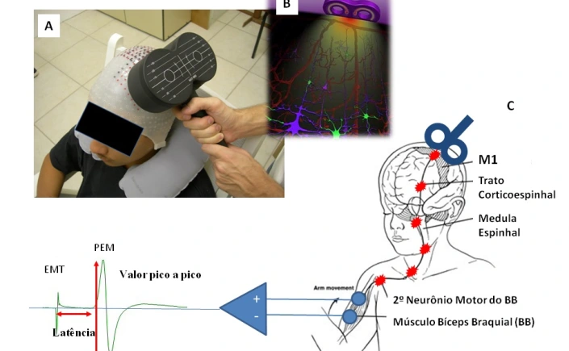

# Therapeutic modality that has been used as an adjunct method in the rehabilitation of patients. <h1>

<!--more-->

Electrosomatossensory stimulation (SES) is a therapeutic modality that has been used as an adjunct method in the rehabilitation of patients with specific sensorimotor deficits. One of these deficits is spasticity, which can manifest in individuals affected by cerebrovascular accidents and impairs their functional performance. 

Despite encouraging reports in the literature regarding the therapeutic use of SES, there is no clarity regarding the effects of this modality on the central nervous system (CNS) and, therefore, no consensus regarding its use in clinical practice. Consequently, different authors have dedicated themselves to investigating how different stimulation parameters can be interpreted by the CNS and how they may impact motor function and corticospinal excitability in patients and asymptomatic subjects. 

Transcranial magnetic stimulation (TMS) has been the most commonly used method in these studies. Through TMS, it is possible to obtain motor-evoked potentials, typically from specific muscles adjacent to the site of SES application, which can contribute to the process of interpreting the effects of SES on corticospinal excitability. Thus, the main objective of our projects is to identify parameters that maximize the therapeutic potential of SES.

