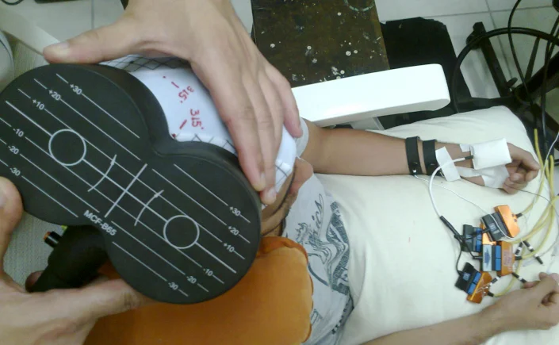

Transcranial Magnetic Stimulation.

<!--more-->

Transcranial Magnetic Stimulation (TMS), also known by its acronym, is a noninvasive technique for brain stimulation. During TMS, intense and short-duration magnetic pulses are generated by a coil positioned over the subject’s head. These magnetic pulses induce electric fields in the brain tissue, leading to the creation of action potentials in groups of neurons on the cortical surface.

When applied over the primary motor cortex (M1), the induced action potential can propagate through the corticospinal tract, reaching the target muscle connected to the corresponding brain region. This results in muscle contractions. The electrical activity of the muscles can be detected using electromyography (EMG) systems.

The signal generated by the muscle contractions due to TMS, as acquired by these systems, is called the Motor Evoked Potential (MEP). The most commonly extracted MEP information includes amplitude and latency. The peak-to-peak amplitude represents the signal’s intensity, defined as the difference between the maximum and minimum MEP values. The latency is the time interval between the application of the TMS pulse and the onset of the MEP. These two characteristics provide valuable insights into cortical structures, corticospinal tract integrity, and the recruited muscle fibers.

